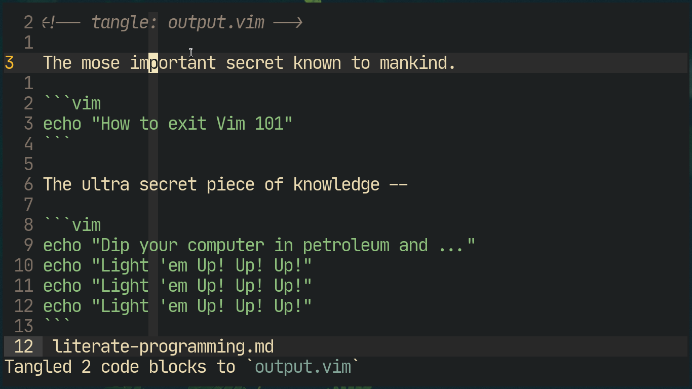
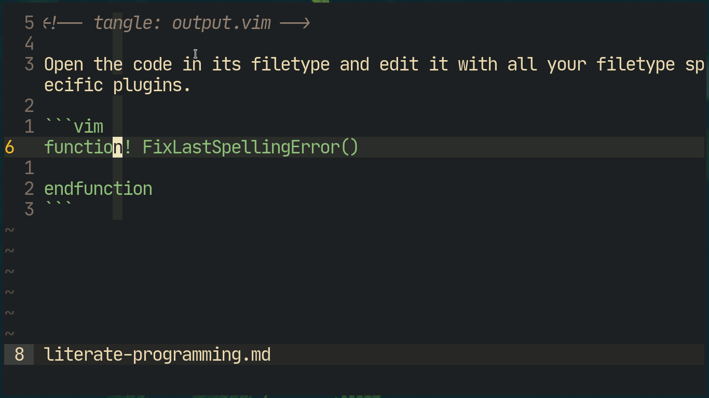
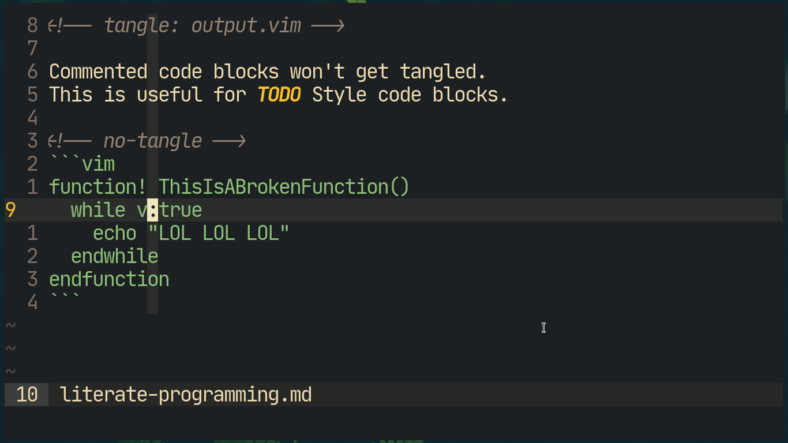

# Neovim Literate
This is the result of me going green-eyed over Org-mode's literate programming features over in Bloa.. I mean Emacsland.\
***Note***: This is merely a pale shadow of the features offered in Org Mode. I know how insanely powerful it is and I won't degrade it by pretending my cobbled-up plugin is even remotely capable of replacing it, so no *yelling* at me!

# Installation
Using Neovim's builtin package system.
```sh
git clone https://github.com/shoumodip/nvim-literate ~/.config/nvim/pack/plugins/start/nvim-literate
```

You can also use any package manager of your choice.

# File Detection
- Works on Markdown files.

# Features
## Tangle
Take the source code present in all the code blocks in the markdown files and write it to a destination file.\
```
<!-- tangle: OUTPUTFILE -->
```
Place this declaration on the **first line** of the markdown file where `OUTPUTFILE` is the file where the code blocks will be tangles to.\
`<Leader>ee` Tangle the code blocks.

***IMPORTANT***: The beginning of each code block **must** have a filetype declared in typical markdown syntax **without** any parenthesis. as shown in the image below otherwise they won't be tangled.



## Code Edit Window
`<Leader>es` Toggle the Source Code editing window in *Normal Mode*.

Open the code present in the code block in a new tab in the filetype of the code block. If the source code is currently being edited, close it and replace the old piece of code with the new code.

***IMPORTANT***: The beginning of the code block **must** have a filetype declared in typical markdown syntax **without** any parenthesis. as shown in the image below.



## Code Block Comments
`<Leader>ec` Comment or uncomment a code block.

A commented code block is marked with
```
<!-- no-tangle -->
```
at its top and it will not get tangled to the output file.

***IMPORTANT***: The beginning of the code block **must** have a filetype declared in typical markdown syntax **without** any parenthesis. as shown in the image below otherwise commenting won't work. Also the file must be marked for tangling (see the section `Tangle` above).



## Code Clipboard
By default, the `w` register will be used for syncing the code blocks with the main file, however you can change it. **Before** sourcing the plugin, place this in your `init.vim` or whatever.
```vim
let g:literate_register = 'a'
```
And this will set the register used to `a`.

# License
MIT
